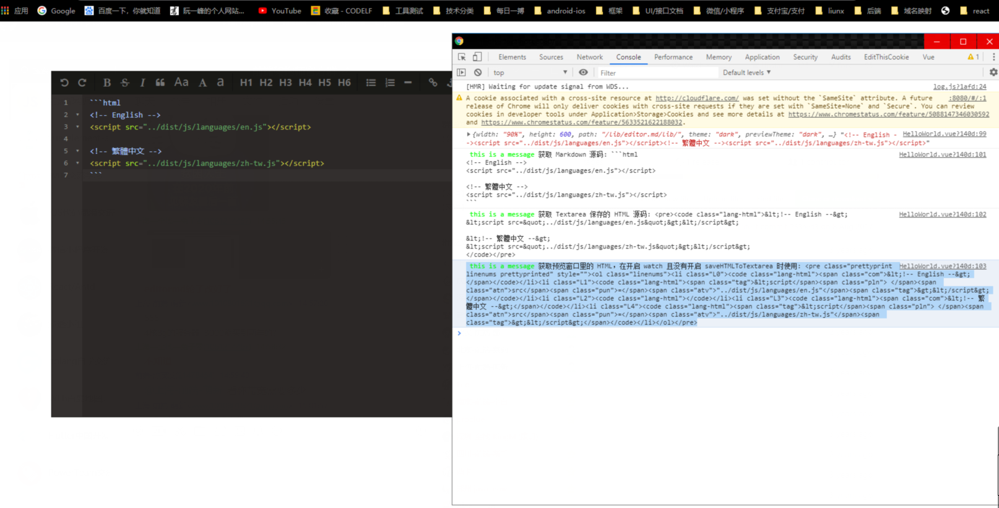

# demo

## Project setup

```
npm install
```

### Compiles and hot-reloads for development

```
npm run serve
```

### Compiles and minifies for production

```
npm run build
```

### Run your tests

```
npm run test
```

### Lints and fixes files

```
npm run lint
```

### Customize configuration

See [Configuration Reference](https://cli.vuejs.org/config/).

# vue-mdeditor

> 基于 VUE 的 markdown 文本编辑器

## 更新历史

- 基于 editor.md 改的 vue 版本（吃水不忘挖井人，谢过了）,

**传送门** ======> [editor.md](https://github.com/pandao/editor.md)

## 使用方法

使用请看源码

## 效果展示


前端架构师官方群:634196762

## 喜欢就关注一下吧。@\_@!!! Click if you like Star
